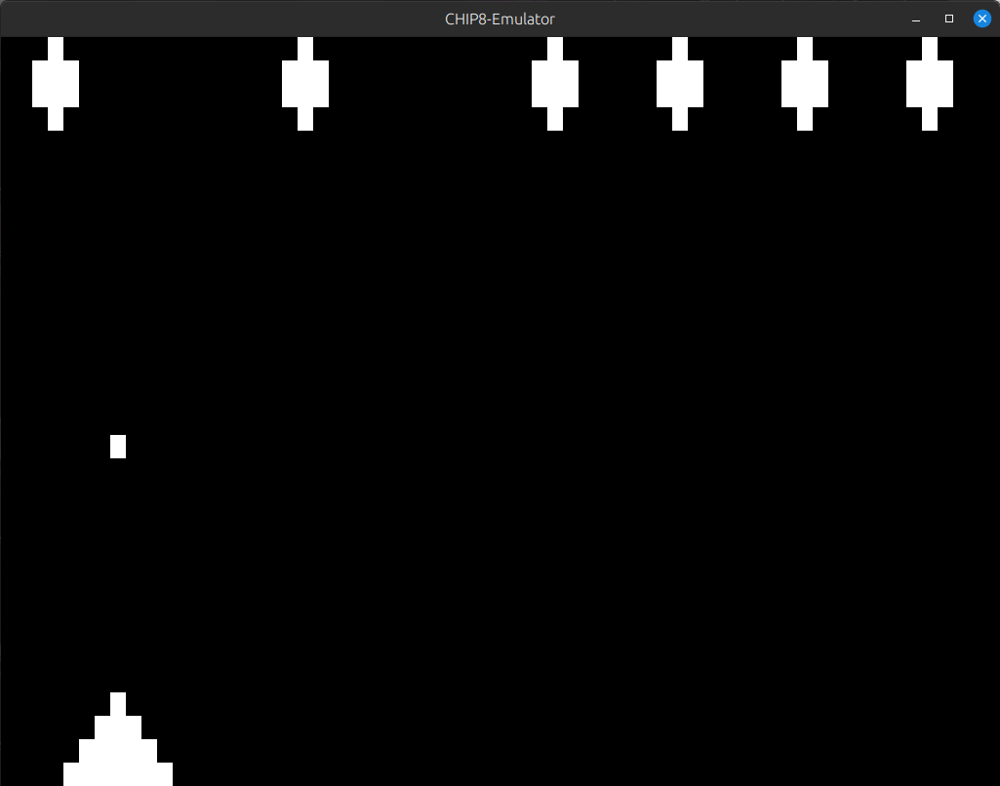
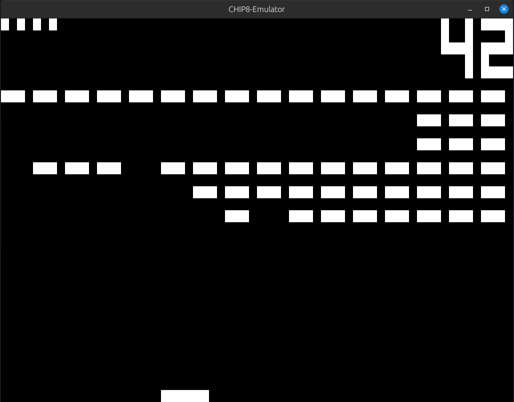
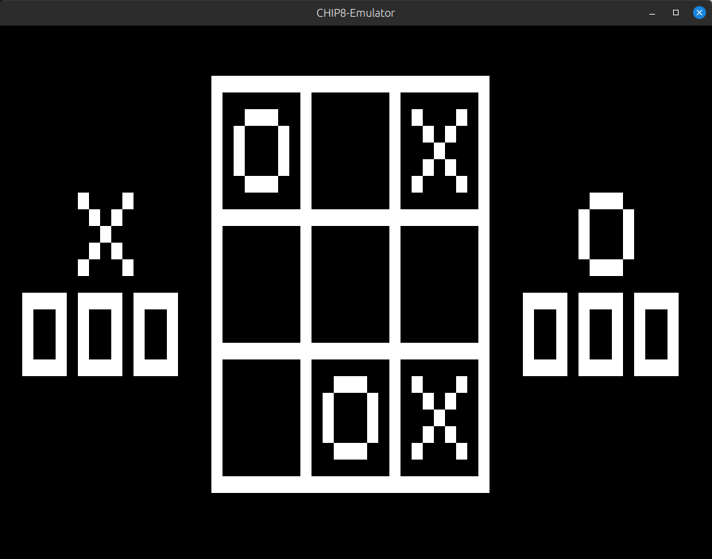

# CHIP-8 Emulator

A CHIP-8 emulator written in C++ and providing graphics with SDL2 library.


*Missile*


*Bricks*


*Tic-Tac-Toe*

## What is CHIP-8?
From [Cowgod's CHIP-8 Technical Reference v1.0](http://devernay.free.fr/hacks/chip8/C8TECH10.HTM) :
> Chip-8 is a simple, interpreted, programming language which was first used on some do-it-yourself computer systems in the late 1970s and early 1980s. The COSMAC VIP, DREAM 6800, and ETI 660 computers are a few examples. These computers typically were designed to use a television as a display, had between 1 and 4K of RAM, and used a 16-key hexadecimal keypad for input. The interpreter took up only 512 bytes of memory, and programs, which were entered into the computer in hexadecimal, were even smaller.<br/><br/>
>In the early 1990s, the Chip-8 language was revived by a man named Andreas Gustafsson. He created a Chip-8 interpreter for the HP48 graphing calculator, called Chip-48. The HP48 was lacking a way to easily make fast games at the time, and Chip-8 was the answer.

## Build

Clone the repository:
```
git clone https://github.com/prasunka/CHIP8-Emulator
```

**Note:** Building requires CMake and SDL2

On Debian based systems, you can use:
```
apt-get install cmake libsdl2-dev
```
to install them.

After installing dependencies, build using:
```
cd CHIP8-Emulator
mkdir build
cd build
cmake ..
make
```

## Run
```
./emulator <ROM file path>
```
## Input

The original 16-key keypad layout looked like this:
| 1     |   2   |   3   |   C   |
|   -   |   -   |   -   |   -   |
| **4** | **5** | **6** | **D** |
| **7** | **8** | **9** | **E** |
| **A** | **0** | **B** | **F** |


To make it more usable on modern keyboards, it has been mapped to the following layout:

| 1     |   2   |   3   |   4   |
|   -   |   -   |   -   |   -   |
| **Q** | **W** | **E** | **R** |
| **A** | **S** | **D** | **F** |
| **Z** | **X** | **C** | **V** |


## TODO:

* Add sound support.
* Render FPS value directly to the window.

## License:
This project is available under the [MIT License](https://github.com/prasunka/CHIP8-Emulator/blob/master/LICENSE).

## References

[*Cowgod's CHIP-8 Technical Reference v1.0*](http://devernay.free.fr/hacks/chip8/C8TECH10.HTM) (**Recommended**)

[*HowToEmulation - CHIP8*](http://www.multigesture.net/wp-content/uploads/mirror/goldroad/chip8.shtml) (**Recommended**)

[*CHIP-8 Wiki*](https://en.wikipedia.org/wiki/CHIP-8)

[*CHIP-8 ported to Rust*](https://github.com/epistelli/dale8) (For non-spoiler code reference)

[*How to write an emulator (CHIP-8 interpreter)*](http://www.multigesture.net/articles/how-to-write-an-emulator-chip-8-interpreter/) (Refer if stuck in program structure)

[*SDL Resource*](https://wiki.libsdl.org/)
<!--(https://adamtcroft.com/playing-sound-with-sdl-c/)-->
